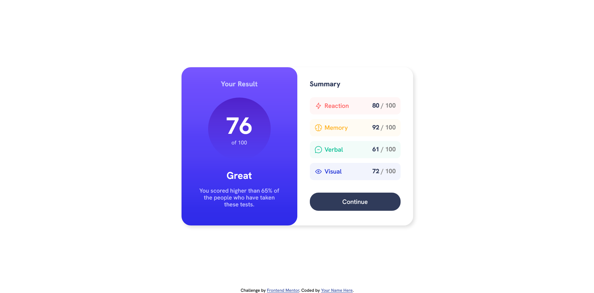

# Frontend Mentor - Results summary component solution

This is a solution to the [Results summary component challenge on Frontend Mentor](https://www.frontendmentor.io/challenges/results-summary-component-CE_K6s0maV). Frontend Mentor challenges help you improve your coding skills by building realistic projects. 

## Table of contents

- [Overview](#overview)
  - [Screenshot](#screenshot)
  - [Links](#links)
- [My process](#my-process)
  - [Built with](#built-with)
  - [What I learned](#what-i-learned)
  - [Continued development](#continued-development)
- [Author](#author)

## Overview

### Screenshot

### Links

- Solution URL: [solution](https://www.frontendmentor.io/solutions/results-summary-component-using-sass-and-dynamically-loaded-data-by-js-k5FWjVblcZ)
- Live Site URL: [website](https://r-s-component.netlify.app)

## My process

### Built with

- Semantic HTML5 markup
- CSS custom properties - SASS
- Flexbox
- CSS Grid
- Mobile-first workflow
- [Parcel](https://parceljs.org/) - web bundler
- JavaScrit- dynamic data loading
- JavaScript animation

### What I learned

For the first time, I loaded data dynamically and created a count animation using JavaScript. I practiced CSS styling using the mobile-first method

### Continued development

I would like to learn how to create more complex JavaScript animations.

## Author

- Website - [BartyDash](https://github.com/BartyDash)
- Frontend Mentor - [@BartyDash](https://www.frontendmentor.io/profile/BartyDash)